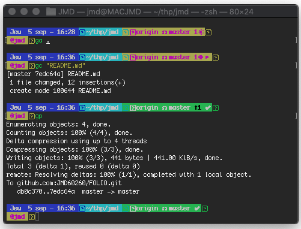
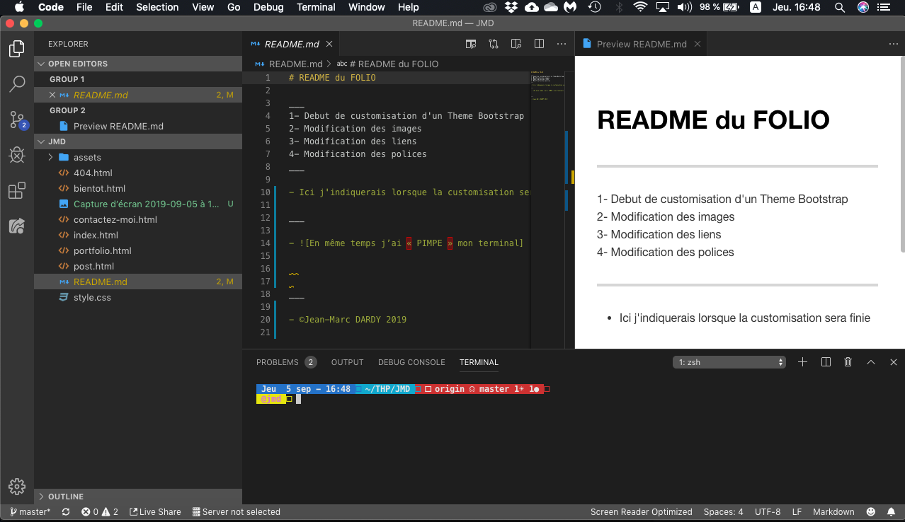

# README du FOLIO

___
1- Debut de customisation d'un Theme Bootstrap

2- Modification des images

3- Modification des liens

4- Modification des polices

___

- Ici j'indiquerais lorsque la customisation sera finie
  
___

## PIMPE mon terminal ##

___

## Mon IDE préféré VSCode ##

1- il est PIMPE ZSH

2- Terminal intégré

3- Quelques extentions sur le Marketplace me permettent de voir en live ce aue je fais comme pour le README par exemple

- ©Jean-Marc DARDY 2019
  